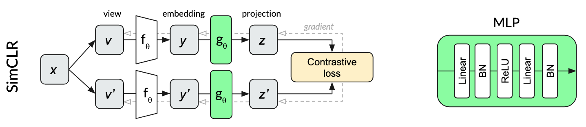

# Self-supervised learning

Self-supervised learning is supervised learning but with a target that can be procedurally generated by the unlabeled data. Examples are filling in the blanks or solving a sorting task.

Well-known methods for computer vision are:
- SimCLR
- MoCo
- BYOL

These methods are known as _contrastive_, because they pull and push representations according to the original class. In all these papers, different views of images are fed into the networks and those coming from the same image are clustered together. 

Note that this makes the networks invariant to the augmentations used to generate the views. Then, the representation is not useful for tasks that do require some information distorted by the augmentations. A way to tackle this is proposed in the paper "What Should Not Be Contrastive in Contrastive Learning".

Most contrastive methods need negative samples, i.e. pairs that should be pushed further apart. Without them, the network does not learn to discriminate.

BYOL does not need the use of negative samples (SimCLR and MoCo do). But it is implicitly contrastive.

Methods with more detail:
- SimCLR: the baseline simple contrastive method. The batch size is huge (4096) because of the need of negative samples. The method is depicted here: 

- MoCo: A non-trivial improvement upon SimCLR. The two paths are not the same now, as one uses a moving average of the other's weights. The batch size can be now 256 because of a memory bank that stores previous representations.

- BYOL: This method uses the same moving average but uses even more asymmetry: The online embedding is projected so as to predict the momentum embedding. No negative samples are needed. 

[This blogpost](https://generallyintelligent.ai/blog/2020-08-24-understanding-self-supervised-contrastive-learning/) explains why BYOL is contrastive: it doesn't work at all without batch normalization (i.e. normalizing using the mean and std of the batch). BYOL original implementation uses a batch size of 4096.

MoCov3 is a simplification and adaptation of MoCov2 to transformers. It removes the memory bank but uses very big batch sizes.

